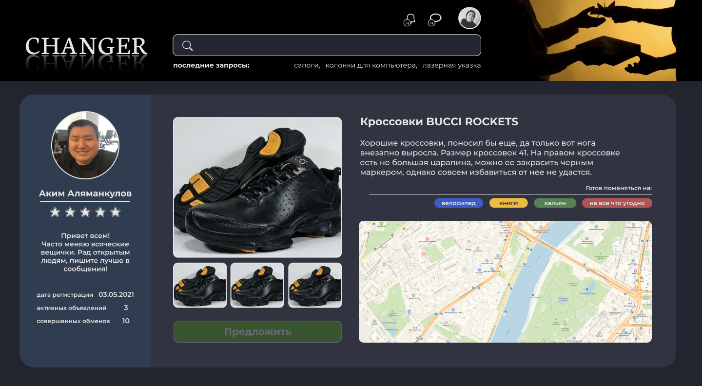

# Добро пожаловать в CHANGER

Данное приложение призвано помочь людям обмениваться не нужными вещами, которые могли бы еще послужить. Главной особенностью приложения является автоматический поиск цепочек для обмена в ситуациях, когда два пользователя не готовы обменяться на прямую, однако через третье/четвертое звено обмен мог бы состояться. Для реализации этой особенности, при создании объявления, пользователь выбирает три желаемых для получения в обмен на свой предмета. В приложении использован API Yandex Maps для отметки удобного места для встречи. Для организации встречи, после одобрения всеми участниками сделки, пользователям становится доступен чат.

## Компоненты приложения

- панель пользователя
- личный кабинет
- добавления объявления
- витрина

- регистрация при помощи JWT
- валидация данных при регистрации
- обработка ошибок

### Технологии примененные в проекте:

React / Redux / Thunk / Express / Mongoose / JWT / WebSockets / Yandex Maps API / Material-UI /

---

В данный момент приложение мною рефакторится, поэтому пока оно не работает "из коробки".

Ссылка на рабочую версию проекта:
https://github.com/gMellog/barter_PROJECT/

